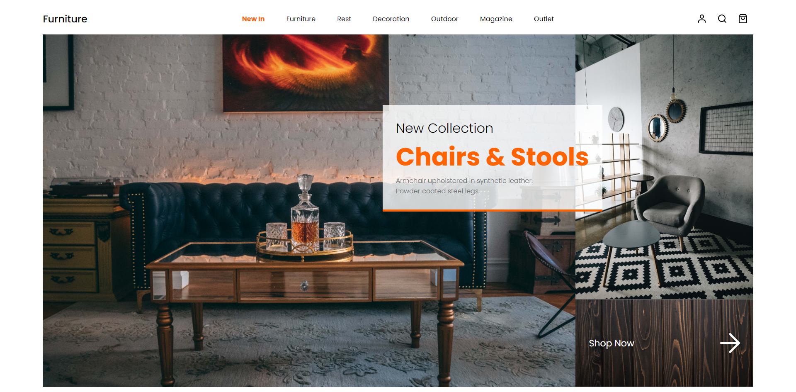

# :full_moon: About The Project

**Furniture** is an activity to test my knowledge of CSS Grid Layout Skills at the **edX Front-End Web Development Bootcamp**. I refactored the code to implement the principles of clean code and semantics.

# :waxing_gibbous_moon: Features

- Clean Code
- Grid Layout Skills
- Semantic HTML

# :first_quarter_moon: Screenshot

# :waxing_crescent_moon: Technologies

- HTML
- CSS

# :new_moon: Credits

N/A

# :earth_americas: Visit The Website

- [Jakes Eatery](https://whybruno.github.io/furniture-page)

# :globe_with_meridians: License

MIT License